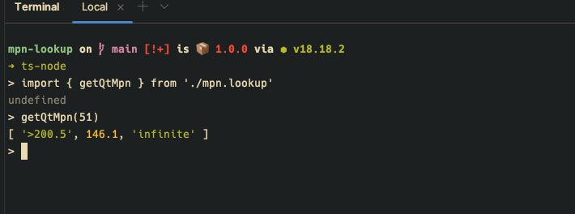
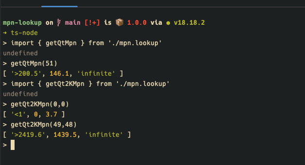

# mpn-lookup

A simple tool for when you don't want to use, or simply can't find, the various reference PDF's for the QuantiTray system.

Built with:  


For the work I used either of the following:


## Try it out:

```bash
1. git clone https://github.com/jonathan-gartland/mpn-lookup.git
2. cd mpn-lookup
3. npm i
4. ts-node
5. > import { getQtMpn } from './mpn.lookup'
6. > getQtMpn(0)
```

## Example use in REPL:

  


## Example App that uses the mpn-lookup library

[https://mpn-nextjs.vercel.app/mpn-lookup](https://mpn-nextjs.vercel.app/mpn-lookup)
